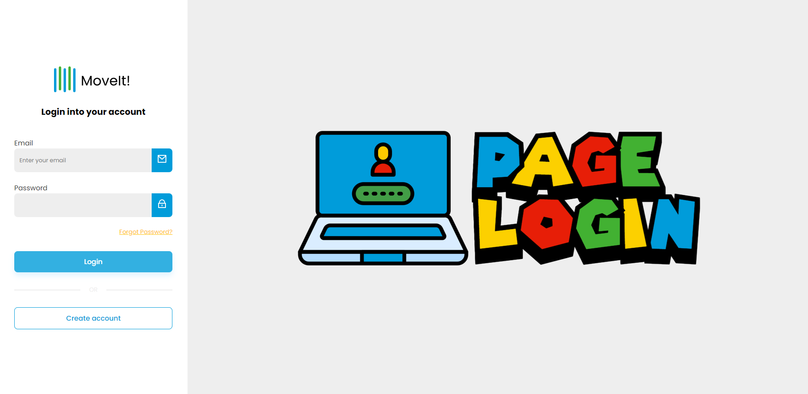

<h1>💻 Login Page</h1>

🎉 Projeto de Login e Cadastro utilizando <strong>Angular</strong> com autenticação e integração com backend.

  

<h2>🌍 Tecnologias Utilizadas</h2>
<ul>
  <li><strong>Angular</strong></li>
  <li><strong>TypeScript</strong></li>
</ul>

<h2>📂 Estrutura do Projeto</h2>
<pre>
.
├── src
│   ├── app
│   │   ├── components
│   │   ├── pages
│   │   ├── services
│   │   └── app.routes.ts  # Configuração de rotas
│   └── assets             # Icones da aplicação
</pre>

<h2>🚀 Iniciando o Projeto</h2>
<ol>
  <li><strong>Clone o Repositório:</strong></li>
  <pre><code>git clone https://github.com/diegomayolo/login-auth-frontend.git
cd login-page</code></pre>

  <li><strong>Instale as Dependências:</strong> 
      Execute o comando abaixo para instalar as dependências do projeto:</li>
  <pre><code>npm install</code></pre>

  <li><strong>Execute a Aplicação:</strong></li>
  <pre><code>npm start</code></pre>
</ol>

Agora, a aplicação estará disponível em <code>http://localhost:4200</code>.

<h2>📜 Endpoints</h2>
<ul>
  <li><strong>POST /auth/register</strong> – Criação de novo usuário</li>
  <li><strong>POST /auth/login</strong> – Login e geração de token JWT</li>
  <li><strong>GET /user</strong> – Perfil do usuário autenticado (requer token)</li>
</ul>

<strong>Nota:</strong> Adicione o token JWT ao cabeçalho das requisições protegidas usando o campo <code>Authorization: Bearer {seu_token}</code>.

<h2>🔑 Funcionalidades Principais</h2>
<ul>
  <li><strong>Cadastro de Usuário:</strong> Armazenamento seguro de credenciais.</li>
  <li><strong>Autenticação JWT:</strong> Geração e validação de tokens de acesso.</li>
</ul>

<h2>📽 Vídeo Tutorial</h2>

Neste repositório, você encontra o código completo abordado no <a href="https://www.youtube.com/watch?v=tJCyNV1G0P4&ab_channel=FernandaKipper%7CDev">vídeo tutorial</a>.🎥

